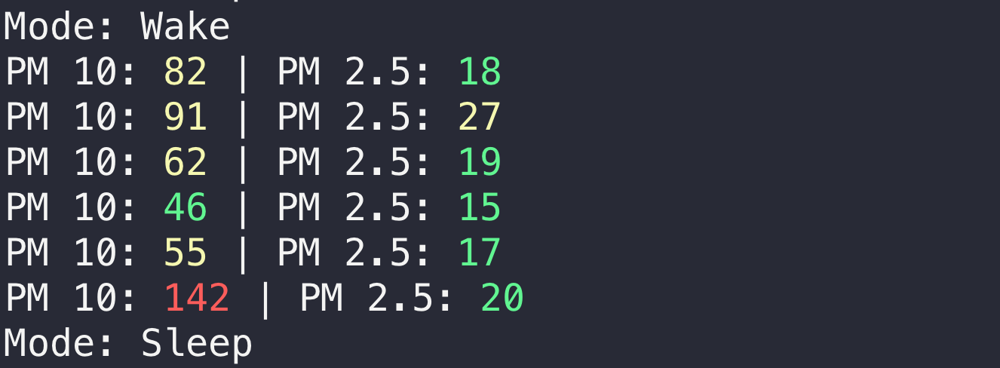

Example Application that reads and controls a [SDS011](https://cdn-reichelt.de/documents/datenblatt/X200/SDS011-DATASHEET.pdf) (Particle Matter Sensor) via an USB-Serial-Adapter.

## Installation & Usage

Install Dependencies:  
`mix deps.get`  

Run the Application with the correct interface name being set:  
`INTERFACE=cu.usbserial-1420 mix run --no-halt`
